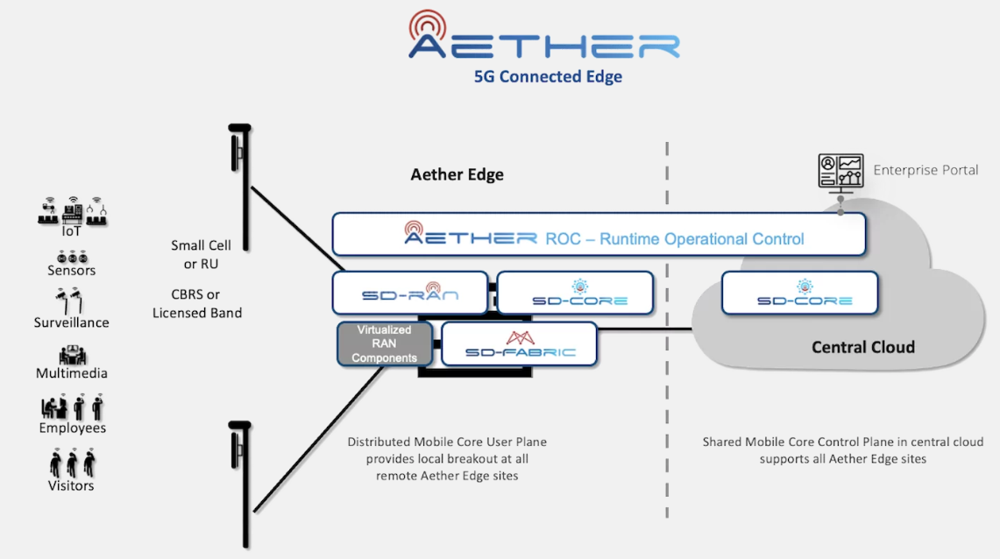
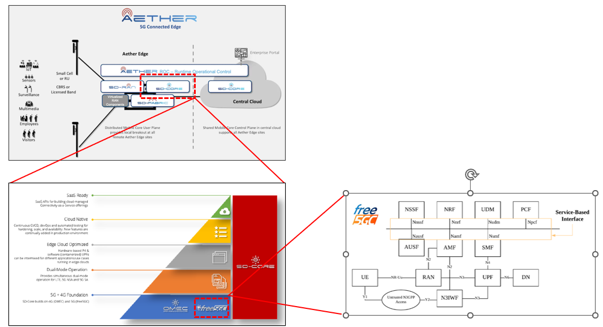
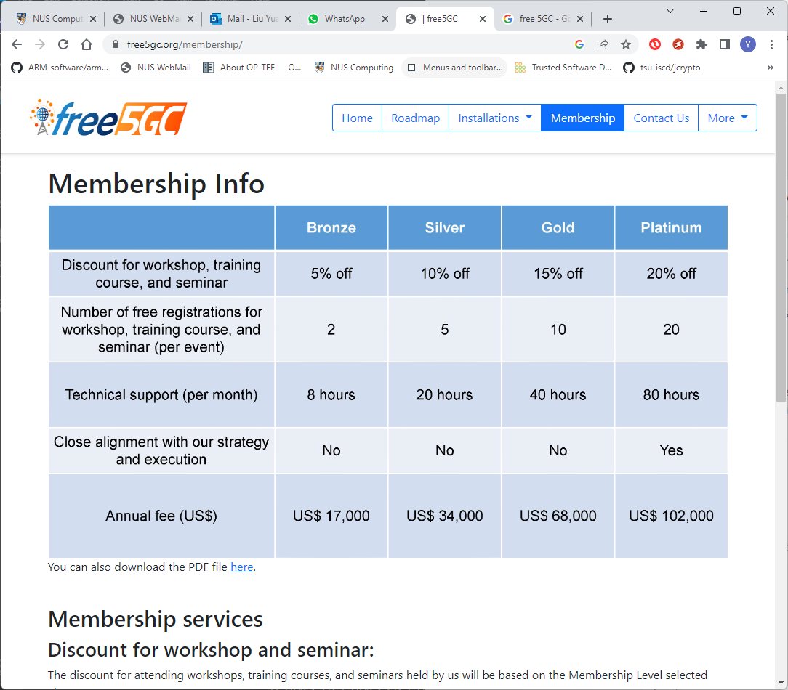
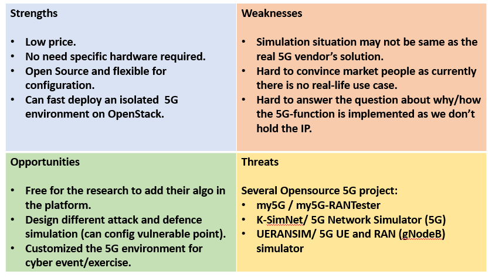

# OpenNetwork Aether Analysis 

https://opennetworking.org/aether/

This is the Aether structure:

The key 5G core network simulator is the "SD-CORE" which is a dual-mode 4G/5G mobile core network solution. SD-Core builds and enhances on Open Networking Foundation 4G Open Mobile Evolved Core (OMEC)™ as well as the free5GC© core network platform. 

SD-Core main components: 

- Dynamically programmable network slicing and subscriber, 
- QoS and policy management, 
- Providing precise access control for users, devices, data networks and edge applications.

This is the aether main structure:

Free 5GC 

The free5GC is an open-source project developed by National Chiao Tung University. It is an open-source project for 5th generation (5G) mobile core networks with containers/vm based all-in-one solution with all the components and the communication(ip-based).

From UE to ip based network

Implement Radio Access Network (RAN) under IP based network (simulate bus-based communication network with the ip based network).

License and technical support rule:

free5GC follows Apache 2.0. That is, anyone can use free5GC for commercial purposes for free. We will not charge any license fee. Because we receive many emails each day asking for technical questions, we are unable to answer all of them. If you want us to answer your questions, please consider joining our [membership program](https://www.free5gc.org/membership/).

Free 5GC link: https://www.free5gc.org/

What we can do: 

Without cooperating with the Aether, we can build 

- A free 5GC stage-2 standalone-5G core network on our server and simulate the basic 5G function from a UE To the internet, so the researcher can do the 5G core network security project and 5G UPF function improvement.
- A free 5GC all-in-One cluster for the 5G education.

Who can use: 

The people how to the 5G core network components introduction training.

The people who want to optimize, implement their network slicing function. 

If we build the Free5GC 5G testbed this is the SWOT Diagram.

Market 4Ps  

**Product**

What you sell?

1. Production 5G-testbed-A: A all in one 5G network simulator for education and basic level 5G security research 

2. Production  5G-testbed-B: A mini size 5G network service for research usage, 5G equipment testing and the 5G cyber security attack&defense cyber exercise/demo. 

   

**Price**

How much do you charge?

1. Production 5G-testbed-A: 

   Researcher: free but their component can be used in NCL's project.

   all-in-one set : may be same as the mid end server rent fee/day + addental technical support fee.

2. Production  5G-testbed-B:

   cyber event: the 5G cluster same as the CISS red ? 

   

**Place**

Where do you promote your product or service?

1. Inside NUS among the 5G research project group and SUTD. 
2. Some cyber event/demo. 

**Promotion**

How do your customers find out about you ? 

With cooperating with aether, we can build

A real 5G core network with all the aether's function, so after purchase a 5G antenna (device list in the 5GC and aether hardware list), other people can test their 5G equipment on our platform.  

------

