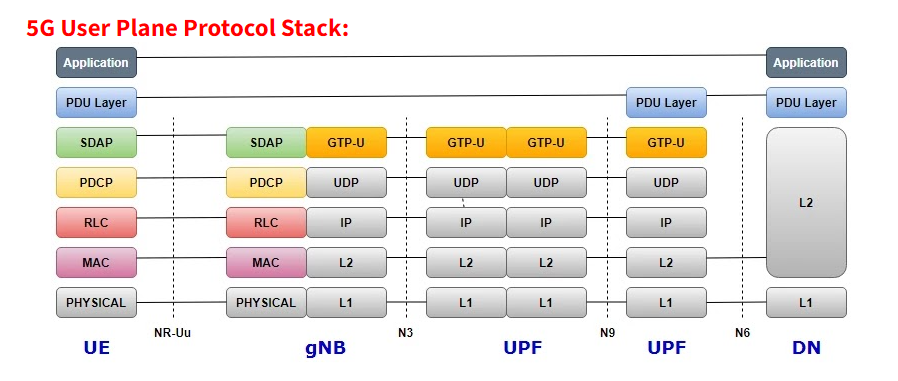

# Aether [5G-OpenNetwork] and free-5GC Analysis 

[TOC]

### Introduction 

In this document, we try to analysis the Aether 5G openNetwork solution main feature [free-5GC] and whether we can use it to build a simple (mini) size virtual 5G test bed on NCL's cluster in short time. 

This is the Aether structure:

Base on the aether's main technical white paper (https://opennetworking.org/wp-content/uploads/2021/08/Aether-Technical-White-Paper-1.pdf) The key 5G core network component is the "SD-CORE" which is a dual-mode 4G/5G mobile core network solution. SD-Core builds and enhances on Open Networking Foundation 4G Open Mobile Evolved Core (OMEC)™ as well as the free5GC© core network platform. 

SD-Core main components ( with 5 level of software implement ) : 

- Dynamically programmable network slicing and subscriber, 
- QoS and policy management, 
- Providing precise access control for users, devices, data networks and edge applications.

This is the aether main structure:

The basic level component of SD-Core is the **OMEC** and **Free 5GC**, this is the key component to convert the Radio Access Network data stream [bus-based] to GPRS Tunneling Protocol (GTP) data stream [ip based]. If we want to do the basic 5G environment testbed without to be subscriber of aether, we may use the Free-5GC. 

#### Free-5GC opensource 5G solution

The free5GC is an open-source project developed by National Chiao Tung University. It is a 5G mobile core networks solution with necessary components (all-in one solution with containers/vm based) and the communication protocol (ip based). It can simulate 5G protocol (N1 - N9) from user equipment(UE) to ip based cloud network. 

It implement Radio Access Network (RAN) under IP based network (simulate bus-based communication network with the ip based network).

##### Free5GC License and technical support rule

free5GC follows Apache 2.0. That is, anyone can use free5GC for commercial purposes for free. We will not charge any license fee. Because we receive many emails each day asking for technical questions, we are unable to answer all of them. If you want us to answer your questions, please consider joining our [membership program](https://www.free5gc.org/membership/).

------

##### Build 5G testbed in NCL

**Solution 1**: Cooperating with aether (to be a subscriber), we can build

A real 5G core network with all the aether's function, so after purchase a 5G antenna (device list in the 5GC and aether hardware list), other people can test their 5G equipment on our platform.  

For the market analysis, we may follow the aether's main page.

**Solution 2**: Build a 5G testbed with all the components by using free-5GC lib.

What we can do: 

Without cooperating with the Aether, we can build 

- A free 5GC stage-2 standalone-5G core network on our servers and simulate the basic 5G function from a UE to the internet, so the researchers can do the 5G core network security project and 5G UPF function improvement.
- A free 5GC all-in-One cluster for the 5G education.

Who can use: 

- The people who want to give the 5G core network components introduction training.

- The people who want to optimize, implement their network slicing function. 

- The people who want to find the 5G network vulnerable point for research. 

- The people who to setup a 5G core network cyber security attack and defense demo/ exercise. 

  

**SWOT**

If we build the Free5GC 5G testbed this is the SWOT Diagram.

**Market 4Ps**  

**Product**

What you sell?

1. Production 5G-testbed-A: An all in one 5G network simulator for education and basic level 5G security research and 5G function implement.

2. Production 5G-testbed-B: A mini size 5G network service for research usage, 5G equipment testing and the 5G cyber security attack&defense cyber exercise/demo. 

   

**Price**

How much do you charge?

1. Production 5G-testbed-A: 

   Researcher: free but their components can be used in NCL's project.

   Normal customer: An all-in-one set may be same as the mid end server rent fee/day + addental technical support fee.

2. Production  5G-testbed-B:

   cyber event: the 5G cluster same as the CISS red ? 

   

**Place**

Where do you promote your product or service?

1. Inside NUS among the 5G research project group and SUTD. 
2. Some cyber event/demo. 

**Promotion**

How do your customers find out about you ? 

1. [Still doing the edit, currently haven't find a good promotion except the customized cyber event]

------

Reference link:

https://opennetworking.org/aether/

Free 5GC link: https://www.free5gc.org/

